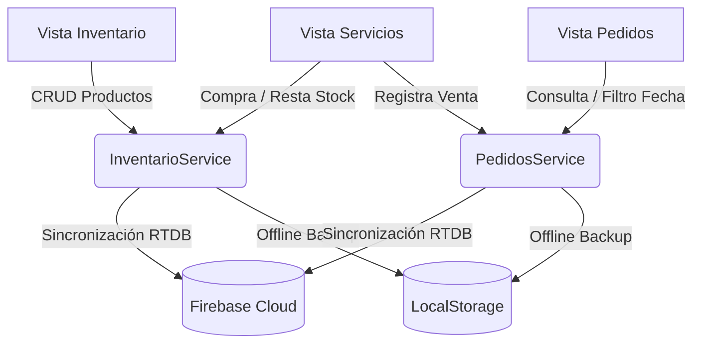

# Verdant - Sistema de Inventario y Consumo Diario

**Verdant** es una plataforma web moderna para la gestión de catálogo de bebidas, control de inventario físico en tiempo real y registro de consumo diario. Cuenta con un diseño VIP inspirado en estéticas oscuras premium y acentos de color rosa neón, brindando una experiencia visual impactante tanto en ordenadores como en dispositivos móviles.

---

## 🏗️ Modelo y Arquitectura del Sistema

La aplicación está diseñada sobre una arquitectura desacoplada y reactiva en el cliente, sincronizada con la nube:

*   **Frontend**: Angular 14 + Bootstrap 4 (Basado en la plantilla Vuexy Admin) + Sass (SCSS) para estilos avanzados y micro-animaciones.
*   **Base de Datos en Tiempo Real**: Firebase Realtime Database (RTDB) para la persistencia en la nube y actualización instantánea en múltiples clientes abiertos.
*   **Caché Fuera de Línea (Offline Backup)**: Integración con LocalStorage para almacenamiento local temporal que asegura el funcionamiento ininterrumpido en caso de cortes de red.



---

## 🗃️ Modelos de Datos (Schemas)

### 1. Item de Inventario (Bebida)
Representa un producto registrado en el inventario que alimenta el catálogo de ventas:
```typescript
interface InventarioItem {
  id: number;
  name: string;
  sku: string;
  category: string; // 'Refrescos' | 'Licores y Alcohol' | 'Natural / Energizante'
  stock: number;
  price: number;
  status: 'IN_STOCK' | 'LOW_STOCK' | 'OUT_OF_STOCK';
}
```

### 2. Registro de Pedido (Consumo)
Representa una transacción de consumo de bebidas por día:
```typescript
interface Pedido {
  id: number;
  dateStr: string;   // Formato de fecha YYYY-MM-DD
  timeStr: string;   // Formato de hora HH:MM
  items: PedidoItem[];
  subtotal: number;
  tax: number;       // Calculado al 10% de impuesto
  total: number;
  clientName?: string;
  clientPhone?: string;
}

interface PedidoItem {
  id: number;
  name: string;
  quantity: number;
  price: number;
}
```

---

## ✨ Características Principales

1.  **Sincronización en la Nube en Tiempo Real**: Toda modificación en el stock de bebidas o la adición de pedidos se refleja instantáneamente en la base de datos de Firebase.
2.  **Catálogo de Servicios Interactivo**:
    *   Precios y totales expresados en Bolivianos (**Bs.**).
    *   Validación de límites: No se permite seleccionar una cantidad superior al stock físico.
    *   **Control de Agotados**: Si el stock de una bebida llega a 0, la tarjeta se bloquea visualmente con un overlay de "Agotado".
3.  **Diseño Responsive Móvil Mejorado**:
    *   **Cuadrícula de 2 Columnas**: Visualización óptima del catálogo en pantallas de smartphones.
    *   **Barra de Carrito Flotante**: Barra inferior fija en móviles que muestra el total acumulado y permite desplazarse suavemente al formulario de facturación.
4.  **Generación de Ticket VIP (Estilo Playboy)**:
    *   Diseño minimalista con logo, detalles de consumo, totales y fecha en estilo retro.
    *   Renderizado en Canvas HTML5 para la descarga directa del ticket como imagen física (`.PNG`).
    *   Envío automatizado a **WhatsApp** al número del cliente con el mensaje pre-configurado y la invitación a adjuntar su ticket.
5.  **Filtro por Selector de Fecha (DatePicker)**:
    *   Reemplazo de los botones estáticos por un calendario dinámico que filtra las ventas de cualquier fecha específica.
    *   Opción para restablecer el filtro y ver el historial completo de consumo.
6.  **Persistencia del Tema VIP**: Coherencia en la paleta de colores oscuros con acentos fucsia/rosa neón (`#ff007f`), que se mantiene estable sin cambiar a modo claro al navegar entre pestañas.

---

## 💻 Comandos del Proyecto

### Instalación de dependencias
Para resolver las dependencias y conflictos de versiones de bibliotecas antiguas del template base:
```bash
npm install --legacy-peer-deps
```

### Servidor de desarrollo local
Inicia el servidor local en `http://localhost:4200/`:
```bash
npm start
```

### Compilación y Despliegue a Producción (Firebase Hosting)
Compila la aplicación optimizada para producción y la sube automáticamente a la nube en un solo comando:
```bash
npm run deploy
```

---

## 🌐 Enlace del Sitio en Producción
El sistema se encuentra desplegado y funcionando de manera pública en la siguiente URL de Firebase Hosting:
👉 **[https://verdant-69.web.app](https://verdant-69.web.app)**
